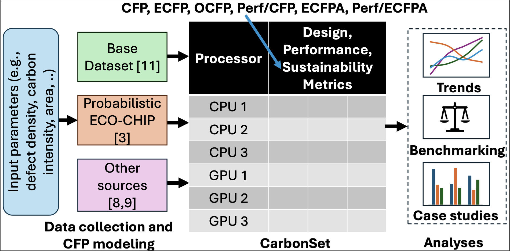

## What is CarbonSet

CarbonSet is a carbon footprint (CFP) dataset contains over 1600 processors. This dataset includes data for desktop and datacenter CPUs and GPUs across multiple metrics - *design metrics* (chip area, technology node, transistors, TDP), *performance metrics* ([Geekbench-OpenCL](https://www.geekbench.com/),[PassMark](https://www.passmark.com/)), and *sustainability metrics* (ECFP, OCFP, total CFP). It also offers composite metrics like Performance per CFP and ECFP per unit area (ECFPA) for deeper tradeoff-based trend analysis



### Dataset

`CarbonSet.csv` is the main dataset containing multiple CFP enhanced metrics stored in `dataset/`folder. The CFP values are modeled using our enhanced ECO-CHIP. Details are explained below and `README.md` in `eco_chip_enhanced/` 

### Updates to ECO-CHIP

We primarily use [ECO-CHIP](https://github.com/ASU-VDA-Lab/ECO-CHIP) to model the CFP of processors. We updated ECO-CHIP to make it probabilistic. This means that input parameters to ECO-CHIP can now be distributions (probability distributions or kernel density estimations) instead of fixed values. This change was inspired by the observation that several parameters that contribute to CFP have uncertainity in them. For example, parameters of semiconductor manufacturing, such as defect density, are not fixed. Instead, they vary due to various factors such as geo-locations, different implementations of a process node and later process improvements, etc. Therefore, in our enhanced ECO-CHIP, the output CFP is a distribution to better cover the wide range of possible values.

You can find the source code in `eco_chip_enhanced` folder, which contains all the required parameters and modeling functions we implemented. 

### Trend analysis for flagship processors

We collected performance metrics of flagship processors over the last decade for both desktop series and datacenter series. The collected datasets can be found in `flagship_trends/dataset`. We provide a historical view of processors design trend in sustainability-performance balance using aforementioned metrics. You can also find the scripts to generate corresponding images for better visualization in the same folder. 

### Case studies

- **How has the AI boom impacted CFP ?**

  We concluded a conservative estimation of  the total CFP increase trend in datacenter GPUs, since modern AI mostly run on NVIDIA datacenter GPUs. We collected revenue data from NVIDIA's Datacenter Business Group annual financial reports and assume 1) All revenue is generated by selling the latest GPU of every year. 2) Every GPU is sold by the highest price over we searched on the internet. The practical number of GPU shipments is significantly higher than our estimations, so does the overall estimated CFP increasing trend.

  You can find the plots, datasets and scripts in `case_studies/AI_Boom` 

- **Is manufacturing cost ($) a valid proxy for Embodied CFP ?** 

  Some states the manufacturing cost ($) might be sufficient to approximate the chip embodied CFP during the manufacturing process, so that we can get rid of detailed modeling of CFP. However, in our study, we collected the manufacturing cost and selling price of flagship datacenter GPUs in 28nm, 14mn, 7nm and 5nm  and compare them to the Embodied CFP numbers correspondingly. The plot shows **Manufacturing cost of selling price are not valid proxies of ECFP**

  You can find the plots, datasets and scripts in `case_studies/ECFP_proxy`

- **How much must processor lifetime increase by to effectively amortize the Embodied CFP ?**

  We sweep the lifetime and idle time of selected flagship processors and further generate a heat map of Embodied CFP vs. Operational CFP. This heat map helps customers to make environment-friendly purchase decisions by considering amortizing the Embodied CFP based their own process lifetime and idle time.

​	You can find the plots, datasets and scripts in `case_studies/ECFP_amortization`

## Which tools/data did we use?

- [ECO-CHIP](https://github.com/ASU-VDA-Lab/ECO-CHIP)
- [Base Dataset](https://chip-dataset.vercel.app/)
- [Base Dataset Analysis Paper](https://arxiv.org/abs/1911.11313)
- [Geekbench-OpenCL](https://www.geekbench.com/)
- [Passmark](https://www.passmark.com/)

## How to use the Repo?

### Requirements

Python >= 3.8, numpy, matplotlib, seaborn, pandas, json

### Function Modules and Notebooks

You can find an out-of-box using notebook generating corresponding plots and CSV files in every sub-folder.

We mainly use the function `eco_chip` in the wrapper python file `eco_chip_func.py` to interact with complicated ECO-CHIP modules. This function accepts 6 input arguments including the `chip area`, `process node`, `chip TDP`, `defective density of the process node`, `gas_per_area (gpa)`, `energy_per_area (eap)` and `carbon_intensity`.

```python
args = argparse.Namespace(design_dir='testcases/CFP_survey/', 
                            chip_area=area, 
                            node=node, 
                            chip_power=power, 
                            defect_density=defect_density,
                            num_lifetime=None, 
                            gpa = gpa_val, 
                            epa = epa_val,
                            carbon_intensity=ci_val)    

c_des, c_mfg, c_ope, c_tot = eco_chip(args)
```

You can generate all the plots and processed CSV datasets by running the notebook `eco_chip_enhanced/cfp_calculation.ipynb` and create a `plots` folder under the `CarbonSet` base path. See details in the python notebook.

## How to contribute?

## How to cite?
